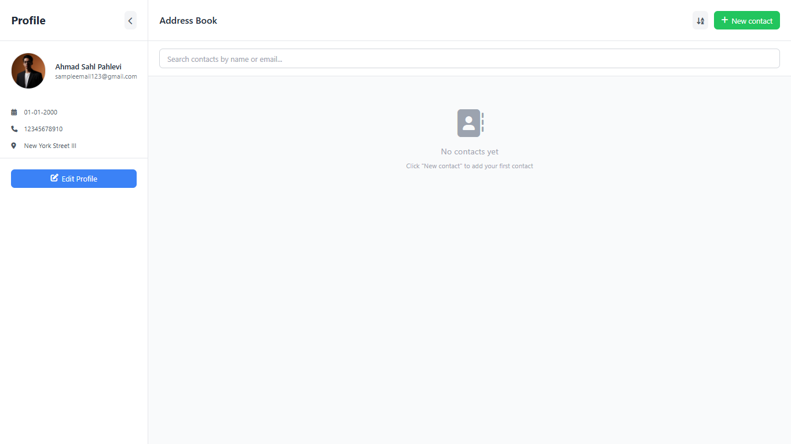
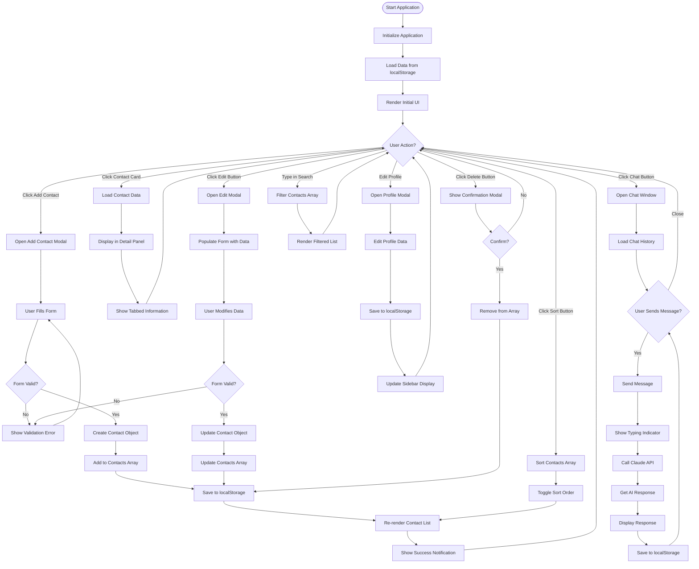

# 📇 Address Book Application

A modern, interactive web-based address book application built with vanilla JavaScript, HTML5, and Tailwind CSS. This application allows users to efficiently manage their contacts with full CRUD operations, advanced search capabilities, and AI-powered chat functionality.



## 📋 Table of Contents

- [Description](#-description)
- [Features](#-features)
- [Tech Stack](#️-tech-stack)
- [Live Demo](#-live-demo)
- [Installation](#-installation)
- [Usage Guide](#-usage-guide)
- [Project Structure](#-project-structure)
- [Flowchart](#-flowchart)
- [JavaScript Implementation](#-javascript-implementation)
- [Developer](#-developer)
- [License](#-license)

## 📖 Description

Address Book is a comprehensive contact management application designed with modern web technologies. The application demonstrates proficiency in DOM manipulation, event handling, local storage management, and responsive design principles. Built as part of the Web Programming Final Exam (UAS) at Universitas M.H. Thamrin.

### Key Highlights:

- **Pure Vanilla JavaScript** - No frameworks or libraries for core functionality
- **Semantic HTML5** - Proper use of semantic tags for better accessibility
- **Responsive Design** - Mobile-first approach with Tailwind CSS
- **Local Storage** - Persistent data storage in the browser
- **AI Integration** - Chat feature powered by Anthropic's Claude API

## ✨ Features

### Core Features (CRUD Operations)

- ✅ **Create** - Add new contacts with comprehensive information
  - Name, phone number, email (required fields)
  - Job title, company, position, department
  - Birthday, address, and notes
  - Form validation to ensure data integrity
- ✅ **Read** - Display and view contacts
  - Dynamic contact list rendering
  - Detailed contact view with tabbed interface
  - Empty state handling
- ✅ **Update** - Edit existing contact information
  - Pre-populated edit form
  - Real-time UI updates after modification
- ✅ **Delete** - Remove contacts safely
  - Confirmation dialog to prevent accidental deletion
  - Automatic UI refresh after deletion

### Additional Features

- 🔍 **Advanced Search** - Real-time search by name or email
- 🔤 **Alphabetical Sorting** - Sort contacts A-Z or Z-A
- 👤 **Profile Management** - Edit personal profile information
- 💬 **AI-Powered Chat** - Chat with contacts using Claude AI
- 🎨 **Responsive UI** - Seamless experience across all devices
- 💾 **Data Persistence** - All data stored in browser's localStorage
- 🎭 **Dynamic Avatars** - Auto-generated avatars with user initials
- 📱 **Sidebar Toggle** - Collapsible sidebar for more screen space
- 🎯 **Tab Navigation** - Organized information in Contact, Work, and About tabs

## 🛠️ Tech Stack

### Frontend Technologies

- **HTML5** - Semantic markup structure
- **CSS3** - Custom styling and animations
- **Tailwind CSS** - Utility-first CSS framework for rapid UI development
- **JavaScript (ES6+)** - Pure vanilla JavaScript for all functionality

### APIs & Libraries

- **Anthropic Claude API** - AI-powered chat responses
- **Font Awesome** - Icon library
- **Google Fonts** - Custom typography

### Development Tools

- **Git** - Version control
- **GitHub** - Code repository and collaboration
- **Vercel** - Deployment platform
- **VS Code** - Code editor

## 🌐 Live Demo

- **Live URL**: [https://address-book-madz21.vercel.app](https://uas-address-book.vercel.app)
- **GitHub Repository**: [https://github.com/Madz-21/uas-address-book](https://github.com/Madz-21/uas-address-book)

## 💻 Installation

### Prerequisites

- Modern web browser (Chrome, Firefox, Safari, Edge)
- Text editor (VS Code recommended)
- Git installed on your system

### Steps

1. **Clone the repository**

   ```bash
   git clone https://github.com/Madz-21/uas-address-book.git
   ```

2. **Navigate to project directory**

   ```bash
   cd uas-address-book
   ```

3. **Open in browser**

   - Simply open `index.html` in your preferred browser
   - Or use Live Server extension in VS Code

   ```bash
   # If you have Python installed
   python -m http.server 8000
   # Then open http://localhost:8000
   ```

4. **Start using the application**
   - No build process or dependencies installation required
   - All assets are loaded via CDN

## 📱 Usage Guide

### Adding a New Contact

1. Click the **"New contact"** button in the header
2. Fill in the required fields (Name, Phone, Email)
3. Optionally add work information and additional details
4. Click **"Save Contact"**
5. The contact will appear in the list immediately

### Viewing Contact Details

1. Click on any contact card in the list
2. Contact details will appear in the right panel
3. Use tabs to switch between Contact, Work, and About information

### Editing a Contact

1. Select a contact from the list
2. Click the **"Edit"** button in the detail panel
3. Modify the information in the form
4. Click **"Save Contact"** to update

### Deleting a Contact

1. Select a contact from the list
2. Click the **"Delete"** button in the detail panel
3. Confirm deletion in the modal dialog
4. Contact will be removed from the list

### Searching Contacts

1. Type in the search bar at the top
2. Results filter in real-time
3. Search works for both name and email fields

### Sorting Contacts

1. Click the sort icon (↓A-Z) in the header
2. Contacts will sort alphabetically
3. Click again to reverse order (↑Z-A)

### Using Chat Feature

1. Select a contact
2. Click the chat icon in the detail panel
3. Type your message and press Enter or click send
4. AI will respond contextually based on the contact's information

## 📁 Project Structure

```
ADDRESS-BOOK/
│
├── assets/
│   ├── CSS/
│   │   └── style.css              # Custom CSS styles and animations
│   ├── Images/
│   │   ├── address-book.png       # Favicon
│   │   └── Gemini1.png            # Profile avatar
│   └── JS/
│       └── address.js             # Main JavaScript file
│
├── index.html                     # Main HTML file (Semantic structure)
├── tailwind.config.js             # Tailwind CSS configuration
└── README.md                      # Project documentation
```

### File Descriptions

#### `index.html`

- Semantic HTML5 structure with proper tags (`<header>`, `<main>`, `<aside>`, `<section>`, `<footer>`)
- Form elements with labels for accessibility
- ARIA attributes for screen readers
- Organized into logical sections: Sidebar, Main Content, Detail Panel, Modals

#### `assets/CSS/style.css`

- Custom CSS animations (fadeIn, slideIn, messageSlide)
- Hover effects and transitions
- Chat window styling
- Sidebar collapse/expand animations
- Tab navigation styles

#### `assets/JS/address.js`

- State management (contacts array, profile object, chat messages)
- CRUD operations implementation
- DOM manipulation functions
- Event listeners setup
- localStorage integration
- AI chat functionality
- Form validation logic

#### `tailwind.config.js`

- Custom color palette
- Extended animations and keyframes
- Custom font configurations
- Shadow and blur effects

## 📊 Flowchart



## 💡 JavaScript Implementation

### Key Concepts Demonstrated

#### 1. DOM Manipulation

```javascript
// Dynamic element creation
const contactElement = document.createElement("div");
contactElement.className = "contact-card";
contactElement.innerHTML = `<div>...</div>`;
contactList.appendChild(contactElement);
```

#### 2. Event Handling

```javascript
// Form submission
contactForm.addEventListener("submit", saveContact);

// Button clicks
addContactButton.addEventListener("click", openAddContactModal);

// Input events
searchInput.addEventListener("input", () => renderContacts(searchInput.value));
```

#### 3. Array of Objects

```javascript
let contacts = [
  {
    id: "1234567890",
    name: "John Doe",
    email: "john@example.com",
    phone: "+1234567890",
    title: "Software Engineer",
    company: "Tech Corp",
    // ... more properties
  },
];
```

#### 4. localStorage Integration

```javascript
// Save
localStorage.setItem("contacts", JSON.stringify(contacts));

// Load
let contacts = JSON.parse(localStorage.getItem("contacts")) || [];
```

#### 5. Form Validation

```javascript
function saveContact(e) {
  e.preventDefault();

  // Validation
  if (!nameInput.value.trim()) {
    showNotification("Name is required", "error");
    return;
  }

  // Process form...
}
```

### Data Flow Architecture

1. **Initialization**: Load data from localStorage
2. **User Action**: Trigger event listener
3. **Data Processing**: Update contacts array
4. **Storage Update**: Save to localStorage
5. **UI Update**: Re-render affected components
6. **Feedback**: Show notification to user

## 🎓 Educational Purpose

This project was developed as part of the **Final Exam (UAS)** for Web Programming course at:

- **University**: Universitas M.H. Thamrin
- **Faculty**: Fakultas Komputer
- **Program**: S-1 Sistem Informasi
- **Semester**: V - Regular
- **Academic Year**: 2025/2026
- **Lecturer**: Abu Sopian, S.Kom, M.Kom

### Project Requirements Met

✅ Semantic HTML structure  
✅ Form elements with labels  
✅ CRUD operations with Array of Objects  
✅ DOM manipulation and event handling  
✅ Form validation  
✅ Professional CSS styling with Tailwind  
✅ Organized Git commits (5+ semantic commits)  
✅ Comprehensive README documentation  
✅ Deployed on Vercel

## 👨‍💻 Developer

**Ahmad Sahl Pahlevi**

- 🎓 Student at Universitas M.H. Thamrin
- 💼 GitHub: [@Madz-21](https://github.com/Madz-21)

## 📝 License

This project is created for educational purposes as part of university coursework.

---

## 🙏 Acknowledgments

- **Abu Sopian, S.Kom, M.Kom** - Course Lecturer
- **Universitas M.H. Thamrin** - Educational Institution
- **Anthropic** - Claude API for chat functionality
- **Tailwind CSS** - CSS Framework
- **Font Awesome** - Icon Library

---

<div align="center">

**⭐ Star this repository if you find it helpful!**

Made with ❤️ by [Ahmad Sahl Pahlevi](https://github.com/Madz-21)

© 2025 Address Book Application. All Rights Reserved.
=======
# uas-address-book
A simple address book application to store and manage contact information
>>>>>>> 58b36b5f5246143a5b018e6da2a8babf60bb0cfb
